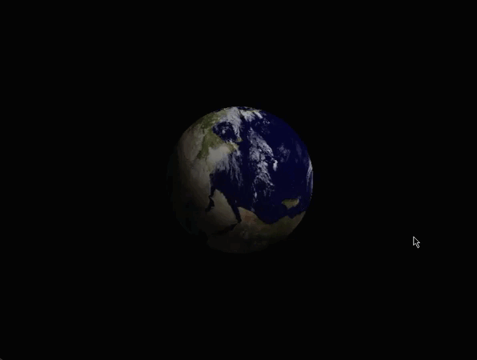

# pyopengl-rotating-model-of-the-earth

[](https://github.com/GrimAveira/pyopengl-rotating-model-of-the-earth/actions)
[](https://github.com/GrimAveira/tkinter-rectangle-collision)
[
](https://github.com/GrimAveira/tkinter-rectangle-collision)

## Content

- [Preview](#preview)

- [Requirements for launch](#requirements-for-launch)

- [How to install](#how-to-install-and-start)

- [Task 25](#task-25)

## Preview

Python OpenGL application, which displays rotating sphere with texture of the earth



## Requirements for launch

- python10

- pyopengl

- pytest

- pyopengl_accelerate

- pillow

- [PyOpenGL_accelerate‑3.1.6‑cp310‑cp310‑win_amd64.whl/](https://www.lfd.uci.edu/~gohlke/pythonlibs/#pyopengl) (x64)

- [PyOpenGL‑3.1.6‑cp310‑cp310‑win_amd64.whl/](https://www.lfd.uci.edu/~gohlke/pythonlibs/#pyopengl) (x64)

## How to install and start

```bash
$ git clone https://github.com/GrimAveira/tkinter-resize-inputed-text-app.

$ pip install pytest

$ pip install PyOpenGL PyOpenGL_accelerate

$ pip install pillow

$ python main.py

```

## Task 25

Напишите программу, изображающую вращающуюся планету Земля.
